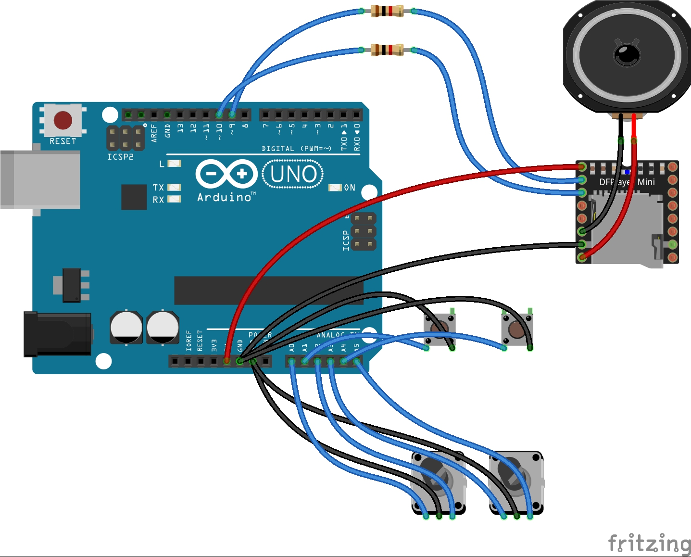

# UCTimer

UCTimerは設定された時間にちょうどサビが来るようにUCを再生するカウントダウンタイマーです

## 必要ライブラリ
 - [ClickEncoder](httpsgithub.comseptillion-gitClickEncoder)
 - [DFRobotDFPlayerMini](httpsgithub.comDFRobotDFRobotDFPlayerMini)
 - [HT1621](httpsmacduino.blogspot.com201502HT1621.html)
 - MsTimer2
 - SoftwareSerial
 - TimerOne

## 使い方
1. 画像のように配線する

また、この画像に加えて、2Pinに液晶ドライバHT1621のCS, 3PinにWR, 4PinにDataを接続する。
2. DFPlayer MiniのSDに0001.mp3という名前でUCを置く。
3. 電源を入れ、ロータリーエンコーダを回して時間をセットする。
4. スイッチを押してタイマーをスタートさせる。
5. タイマー終了41秒前になるとUCがはじめから再生される。
6. タイマーが終了すると同時にUCのサビが訪れる。